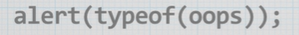

# Задание 3.1
___
1. Попросите пользователя ввести любое число и сохраните его в переменную. 

2. Создайте калькулятор, который будет выполнять все арифметические операции над любыми введенными пользователем двумя числами.

3. Необходимо попросить пользователя задумать число. Затем он должен умножить это число на 2 и прибавить к полученному результату 7. То, что вышло в итоге, нужно ввести в диалоговом окне prompt(). Вы должны выдать пользователю, какое число он задумал.

4. С помощью метода prompt() получите сначала имя пользователя, затем год его рождения и сохраните в 2 переменные. Вычислите возраст пользователя, и выведите его в абзаце с помощью document.write() в таком формате "Антон: 24".

5. Сохраните калькулятор и отправьте на GitHub в репозиторий Student, используя формат в названии Фамилия(латинскими буквами)_1.

## Дополнительные задания
- Выведите на экран тип используемой переменной.

