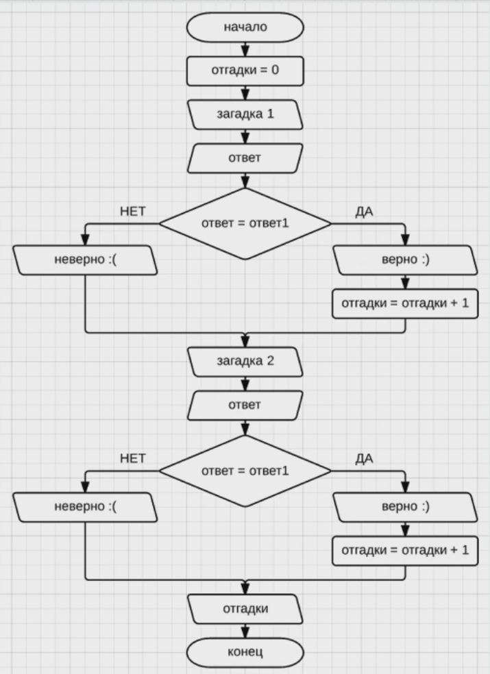

# Задание 3.2

___

- Реализовать представленную блок-схему посредством JavaScript

- Напишите программу на Java Script, которая считает от 1 до 10.
- Создайте программу для застолий, которая будет предлагать «Еще по одной?» пока пользователь не введет единицу.
- Вычислите факториал числа (вашего порядкового номера в журнале).
- Напишите программу, которая проверяет вашу фамилию на палиндром.
- Выведите все простые числа от 1 до вашего порядкового номера в журнале.
- Загрузите три полученные программы на GitHub в репозиторий Student, используя формат в названии Фамилия(латинскими
  буквами)_2.