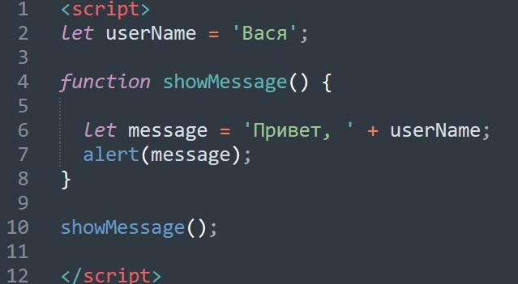

# Задание 3.4

---

-
- Скопируйте код и проанализируйте его работу:
```
function showMessage() {
    let message = "Привет, я JavaScript!"; // локальная переменная
    alert( message );
}
showMessage(); // Привет, я JavaScript!
alert( message ); //
```

- Напишите функцию JavaScript, которая проверяет, является ли переданная строка палиндромом или нет (код из прошлой
  практической работы)?
- Заменить отрицательные элементы в числовом массиве из n чисел (n>10) их квадратами, оставив остальные без изменения (
  код
  из прошлой практической работы).
- Создайте класс, который будет сохранять в переменную имя пользователя и выводить его на экран. Используйте его.
- Перепишите код с использованием синтаксиса класса:



- Создайте класс, который переворачивает ваше имя.

- Загрузить созданные программы на GitHub в репозиторий Student, используя формат в названии Фамилия(латинскими
  буквами)_4.